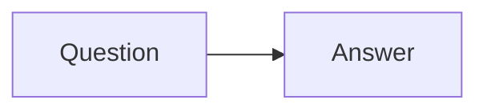

# Answer Note Schema

Use one Markdown file per question. Prefix filenames with a global two-digit
number so the trainer can sort and match answer versions:

```text
light-answers/Topic 01 - Basics/01 - What Is X.md
complete-answers/Topic 01 - Basics/01 - What Is X.md
```

## Compact note template

````md
# Title

Source: `question-list.md`, Question 01

Original question:

> Exact question text.

## Main idea

TODO

## Minimum answer

- TODO

## Formulas / scheme

TODO

## Diagram



## Examiner follow-ups

- TODO

## Common mistakes

- TODO
````

## Complete answers

Complete answers may use the same sections or richer sections from a detailed
study source. Preserve the same filename and topic folder as the compact note so
the app can pair answer versions by question number.

## Rendering rules

- Inline math: `$...$`
- Display math: `$$...$$`
- Mermaid: use one fenced block per diagram.
- Quote labels containing `[]`, `|`, `<`, `>`, or formula-like text:
  `A["Power spectrogram |X[m,k]|^2"]`.
- Prefer local assets under `assets/`; do not hotlink images unless the user
  explicitly asks for remote media.
